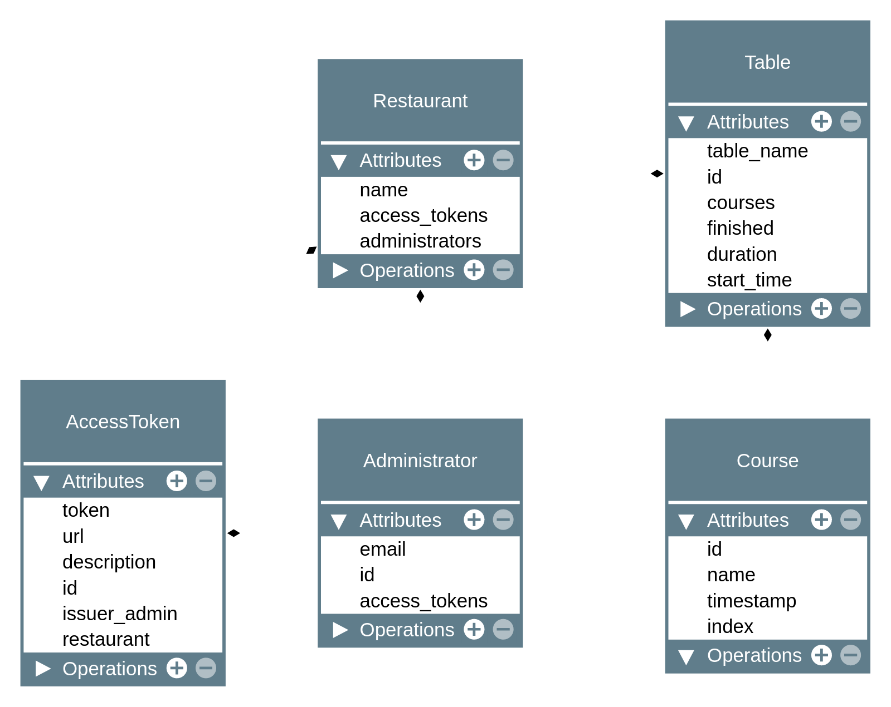

# ARCHITECTURE
This system is divided in three main components:
- Flask backend
- React frontend
- Docusaurus docs

The backend is monolithic (this system is right now actually only one domain).

## BACKEND
The backend is built using Flask. 

- Each different service (REST API, REALTIME API, AUTH, ...) is divided into its own blueprint.
- Any event which has or could potentially have more than one triggers, or interested listeners, shall use a
[Blinker](https://pythonhosted.org/blinker/) signal (in `server/signals.py`).
- In order to ease (proper) testing, we use [Dependency Injector](https://python-dependency-injector.ets-labs.org/introduction/di_in_python.html) (in `server/containers.py`).

## FRONTEND
Create-react-app is used as the basis.

# MODELS

# DATABASE
The database design follows from the previous models; SQLAlchemy (ORM) is used to this end.

# SERVER API
The Flask backend exposes two APIs:
- **REST API**: standard API for performing CRUD operations on the different resources
- **REALTIME API**: since multiple devices might be connected and managing the same restaurant, a Socket.io realtime API will let the different clients send and receive updates regarding their restaurant.

## REST API
A full CRUD API of all models is exposed at `/api/v1/...`.

### auth
The REST API is generally inaccessible. Administrators shall have access to creating restaurants and managing their restaurants, as well as creating access tokens for them. On the other hand, access tokens can be used to GET information related to the restaurant, tables and courses.

## REALTIME API
The realtime API should allow notifying anything that can happen in the realtime domain and is exposed at `/realtime/v1/...`.
- `/realtime/v1/service/...`
  - `/realtime/v1/table/create`
  - `/realtime/v1/table/read`
  - `/realtime/v1/table/update`
  - `/realtime/v1/table/delete`
  - `/realtime/v1/table/course/...`
    - `/realtime/v1/table/course/create`
    - `/realtime/v1/table/course/read`
    - `/realtime/v1/table/course/update`
    - `/realtime/v1/table/course/delete`
  
### auth
Access tokens can be used to initiate the Socket session in a concrete Restaurant room.
